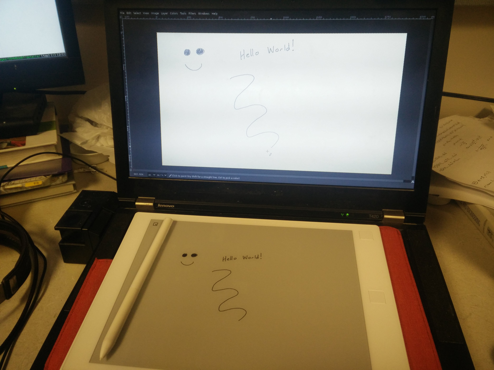

# remarkable_mouse

Use your reMarkable as a graphics tablet.

Special thanks to [canselcik](https://github.com/canselcik/libremarkable) and [LinusCDE](https://github.com/LinusCDE/rmWacomToMouse) for inspiration.



# Usage

``` bash
pip install remarkable-mouse
remouse
```

By default, `10.11.99.1` is used as the address.  Seems to work pretty well wirelessly, too.

# Examples

``` bash
# specify address, monitor, orientation, password
remouse --address 192.168.1.1 --orientation right --monitor 1 --password foobar

# pubkey login
ssh-keygen -f ~/.ssh/remarkable -N ''
ssh-copy-id -i ~/.ssh/remarkable.pub root@10.11.99.1
remouse --key ~/.ssh/remarkable
```
