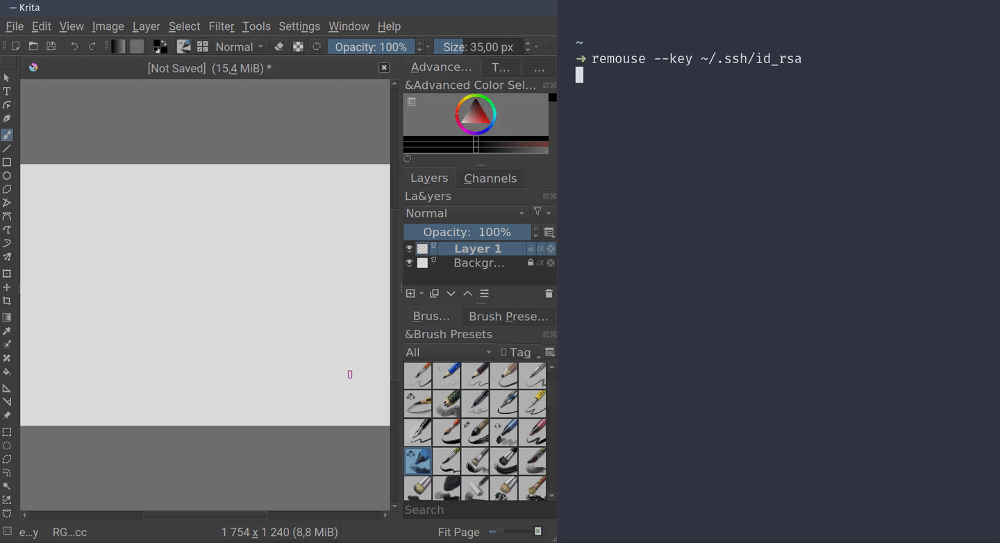

# remarkable_mouse

Use your reMarkable as a graphics tablet.

Special thanks to [canselcik](https://github.com/canselcik/libremarkable) and [LinusCDE](https://github.com/LinusCDE/rmWacomToMouse) for inspiration.



# Quick Start

On the host machine

``` bash
pip install remarkable-mouse
remouse
```

By default, `10.11.99.1` is used as the address. Seems to work pretty well wirelessly, too. By default ssh-agent is used to authenticate if it is available, otherwise you are asked for your password.

# Examples

specify address, monitor, orientation, password

``` bash
remouse --address 192.168.1.1 --orientation right --mode fit --monitor 1 --password foobar
```
passwordless login

``` bash
ssh-keygen -m PEM -t rsa -f ~/.ssh/remarkable -N ''
ssh-copy-id -i ~/.ssh/remarkable.pub root@10.11.99.1
remouse --key ~/.ssh/remarkable
```

# Usage

    usage: remouse [-h] [--debug] [--key PATH] [--password PASSWORD]
                  [--address ADDRESS] [--mode {fit,fill}]
                  [--orientation {top,left,right,bottom}] [--monitor NUM]
                  [--threshold THRESH] [--evdev]

    use reMarkable tablet as a mouse input

    optional arguments:
      -h, --help            show this help message and exit
      --debug               enable debug messages
      --key PATH            ssh private key
      --password PASSWORD   ssh password
      --address ADDRESS     device address
      --mode {fit,fill}     scale setting
      --orientation {top,left,right,bottom}
                            position of tablet buttons
      --monitor NUM         monitor to output to
      --threshold THRESH    stylus pressure threshold (default 600)
      --evdev               use evdev to support pen pressure (requires root,
                            Linux only)
